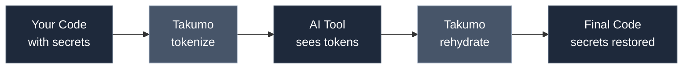

# AI Tool Integrations

Takumo sits between your code and AI assistants. Same protection, any tool.

## How it works

<Frame>

</Frame>

## Supported tools

| Tool | Integration | Status |
|------|-------------|--------|
| [Claude Code](/ai-tools/claude-code) | CLI wrapper, MCP server | Available |
| [Cursor](/ai-tools/cursor) | Extension, proxy mode | Available |
| [Windsurf](/ai-tools/windsurf) | Extension | Available |
| VS Code + Copilot | Extension | Coming soon |
| JetBrains + AI Assistant | Plugin | Coming soon |

## Integration patterns

### CLI wrapper

Wrap your AI tool's CLI to automatically tokenize input and rehydrate output:

```bash
# Instead of:
claude "Add retry logic to config.ts"

# Use:
takumo-aegis shield config.ts --prompt "Add retry logic"
```

### MCP server

For tools that support [Model Context Protocol](https://modelcontextprotocol.io), Takumo runs as an MCP server that intercepts file reads:

```json
{
  "mcpServers": {
    "takumo": {
      "command": "takumo-aegis",
      "args": ["mcp-server"]
    }
  }
}
```

### Proxy mode

Route API calls through Takumo's local proxy to tokenize requests and rehydrate responses:

```bash
takumo-aegis proxy --port 8080
```

Then point your AI tool at `http://localhost:8080` instead of the provider's API.

## Choosing an integration

| Use case | Recommended |
|----------|-------------|
| Quick, one-off tasks | CLI wrapper |
| Full IDE experience | Extension/plugin |
| Custom workflows | API + MCP server |
| CI/CD pipelines | Proxy mode |

Each tool page has specific setup instructions and configuration options.
