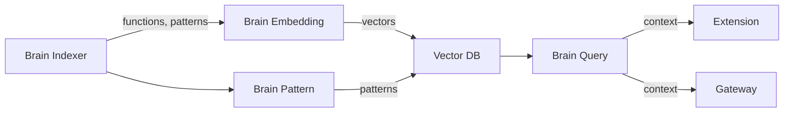

# Brain Intelligence

Brain is Takumo's code intelligence layer. It indexes your repos and provides contextual information — relevant functions, established patterns, architecture boundaries — to the extension and gateway.

---

## What it provides

| Context | Description |
|---------|-------------|
| **Relevant functions** | Functions in your codebase related to the file you're editing. Ranked by relevance score. |
| **Established patterns** | Recurring coding patterns across your repos (error handling, auth, validation). Usage counts show how established each pattern is. |
| **Architecture boundaries** | Security and structural boundaries — auth layers, API boundaries, trust zones. |
| **Dependency context** | Dependencies relevant to the current file with version and usage info. |

---

## Architecture

4 services work together:

### Brain Indexer

Scans connected repos. Extracts function signatures, detects patterns, maps architectural boundaries. Indexing is automatic after repo connection and incremental — only changed files are re-indexed.

### Brain Embedding

Generates vector embeddings for semantic code search. Converts function signatures and pattern descriptions into vectors stored in the vector database.

### Brain Pattern

Analyzes repos for repeated coding patterns. Identifies how your team handles authentication, error handling, data validation, and other cross-cutting concerns.

### Brain Query

Serves contextual queries from extensions and the gateway. Takes a file path and returns relevant functions, patterns, boundaries, and dependency context ranked by relevance.

---

## How indexing works

<Steps>
  <Step title="Connect a repo">
    Via GitHub, GitLab, or Bitbucket integration in the dashboard.
  </Step>
  <Step title="Indexer scans">
    Brain Indexer clones the repo and extracts functions, patterns, and boundaries.
  </Step>
  <Step title="Embeddings generated">
    Brain Embedding converts extracted data into vectors for semantic search.
  </Step>
  <Step title="Patterns detected">
    Brain Pattern identifies recurring patterns across the codebase.
  </Step>
  <Step title="Ready to query">
    Brain Query serves results to the extension and gateway.
  </Step>
</Steps>

Incremental re-indexing happens on push events via webhook.

---

## Using Brain

### In the extension

`Cmd+Shift+P` → **Takumo: Show Brain Context**

Results appear in the side panel. Requires authentication.

### In the gateway

Brain context enriches Sentinel scans. When Sentinel evaluates AI-generated code, Brain provides architectural context to reduce false positives — e.g., knowing that a function is behind an auth boundary.

---

<CardGroup cols={2}>
  <Card title="Brain in Studio" icon="monitor" href="/studio/brain-context">
    Use Brain from your editor
  </Card>
  <Card title="Deploy Brain" icon="cloud" href="/deployment/brain">
    On-prem Brain stack deployment
  </Card>
</CardGroup>
