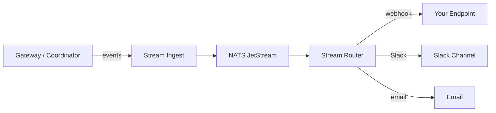

# Takumo Stream

Takumo Stream is the event pipeline. It routes detection events to external destinations — webhooks, Slack, email — based on subscription filters.

---

## How it works

1. Detection events flow from the gateway and coordinator to Stream Ingest
2. Ingest writes events to NATS JetStream for durable delivery
3. Stream Router reads events and matches them against subscriptions
4. Matched events are delivered to the configured destination
5. Failed deliveries go to the dead letter queue for retry

---

## Concepts

### Destinations

Where events are delivered. Each destination has a type and encrypted credentials.

| Type | Description |
|------|-------------|
| Webhook | HTTP POST to your endpoint |
| Slack | Message to a Slack channel |
| Email | Email notification |
| Custom | Any HTTP endpoint with custom headers |

Credentials are AES-256-GCM encrypted at rest. The wire format is `nonce(12) || ciphertext+tag(16)` with AAD of `{orgId}:{destinationId}`.

### Subscriptions

Filters that determine which events go to which destinations.

| Filter | Description |
|--------|-------------|
| Event type | `secret.detected`, `policy.violated`, `scan.complete` |
| Severity | critical, high, medium, low |
| Repository | Specific repos or all |

One destination can have multiple subscriptions. One subscription targets exactly one destination.

### Dead letter queue

Failed deliveries are captured in the DLQ. You can:
- View failure reason and payload
- Retry individual events
- Bulk retry
- Delete

### Receipts

Every delivery attempt is tracked:
- Delivery status (success, failed, pending)
- HTTP response code
- Timestamp
- Retry count

---

## Permissions

| Permission | What it grants |
|------------|---------------|
| `streaming.read` | View destinations, subscriptions, DLQ, receipts |
| `streaming.write` | Create/edit destinations and subscriptions |
| `streaming.admin` | Full control including deletion |

<Note>Billing Admins have no streaming permissions. The streaming section is hidden from the sidebar and command palette for users without `streaming.read`.</Note>

---

<CardGroup cols={2}>
  <Card title="Dashboard Streaming" icon="radio" href="/dashboard/streaming">
    Manage streaming in the dashboard
  </Card>
  <Card title="Deploy Stream" icon="cloud" href="/deployment/streaming">
    On-prem Stream pipeline deployment
  </Card>
</CardGroup>
