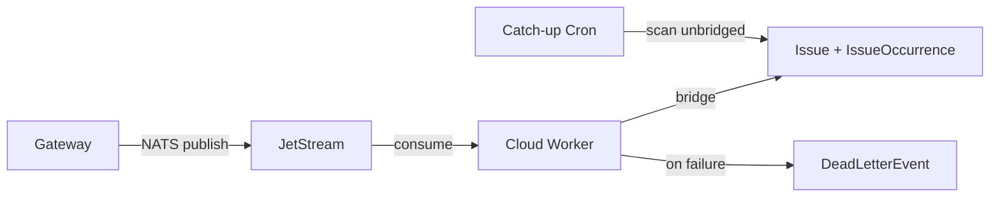

The Cloud Worker is a standalone process that runs alongside the Cloud API. It consumes detection events from NATS, bridges them into the issue tracker, and handles periodic sync jobs.

---

## What it does

| Job | Description |
|-----|-------------|
| **NATS consumer** | Subscribes to `takumo.detections.>` via JetStream. Converts detections into Issues. |
| **Catch-up cron** | Every 30 minutes, scans for unbridged `TelemetryEvent` records from the last 24 hours. Safety net for missed NATS messages. |
| **Bitbucket sync** | Periodic security sync for Bitbucket repos (complements webhook-based sync). |
| **Dead letter** | Failed events go to the `DeadLetterEvent` table after 3 retries with exponential backoff. |

---

## Detection flow



### NATS consumer

The worker subscribes to `takumo.detections.>` with a durable consumer named `cloud-worker-consumer` in the `cloud-workers` queue group. Each message contains:

```json
{
  "orgId": "org_abc123",
  "eventType": "SECRET_DETECTED",
  "detections": [
    {
      "category": "aws_access_key",
      "value": "[REDACTED]",
      "filename": "src/config.ts",
      "line": 42,
      "confidence": 0.98
    }
  ]
}
```

Event types: `SECRET_DETECTED`, `SECRET_BLOCKED`, `VULNERABILITY_DETECTED`.

### Detection bridge

The bridge (`lib/shield-bridge.ts`) converts raw detections into Issue records:

1. Group detections by `(category, filename, repo)`
2. Upsert an `Issue` for each group
3. Create an `IssueOccurrence` for each individual detection
4. Mark the source `TelemetryEvent` as `bridged: true`

### Catch-up cron

Runs every 30 minutes. Queries for `TelemetryEvent` records where `bridged = false` and `createdAt` is within the last 24 hours (with a 5-minute grace period to avoid racing the NATS consumer).

Uses optimistic locking — updates `bridged: false → true` atomically so multiple workers don't double-process. Batch size: 100 events per run.

### Dead letter handling

After 3 failed retries (1s, 2s, 4s exponential backoff), events are written to the `DeadLetterEvent` table with the failure reason. These appear in the dashboard's DLQ page for manual retry.

---

## Deployment

The worker runs the same Docker image as the Cloud API with a different entrypoint:

```bash
node worker/dist/index.js
```

| Port | Purpose |
|------|---------|
| `3001` | Health server (`/health`, `/metrics`) |

Requires `NATS_URL` — the worker will fail to start without a NATS connection.

<Warning>The worker and the Cloud API share the same database. Do not run the worker against a different database than the API.</Warning>

---

## Configuration

| Variable | Description | Default |
|----------|-------------|---------|
| `NATS_URL` | NATS server URL | Required |
| `NATS_NKEY_SEED` | NKey seed for authentication | Required in production |
| `CATCHUP_INTERVAL_MS` | Catch-up cron interval | `1800000` (30 min) |
| `CATCHUP_BATCH_SIZE` | Events per catch-up run | `100` |
| `CATCHUP_LOOKBACK_HOURS` | How far back to scan | `24` |

---

<CardGroup cols={2}>
  <Card title="Streaming Concept" icon="radio" href="/concepts/streaming">
    How the event pipeline works
  </Card>
  <Card title="Deploy Worker" icon="cloud" href="/deployment/overview">
    Worker deployment configuration
  </Card>
</CardGroup>
