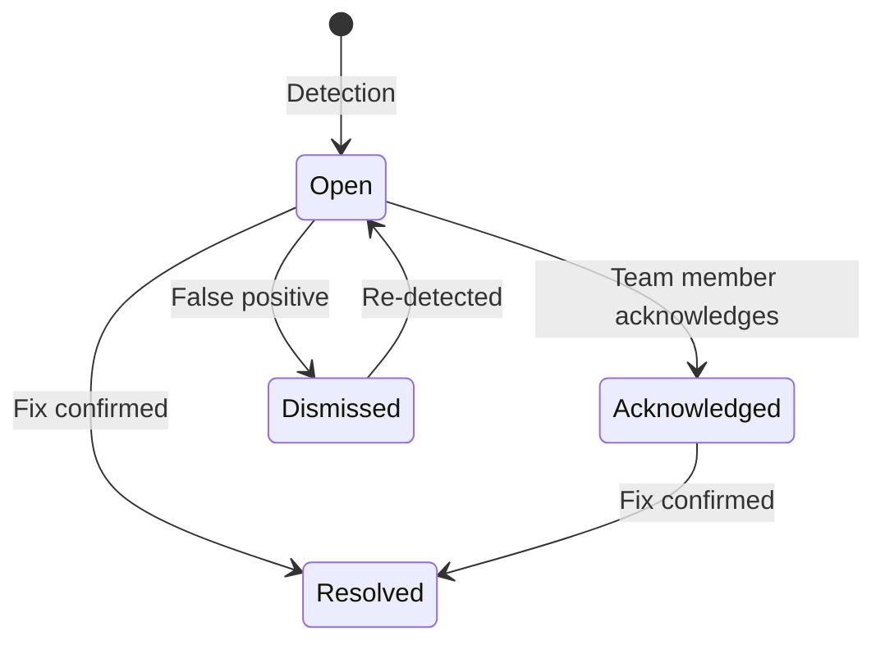

Every secret detection and security finding is tracked as an Issue. This page is where you triage, assign, and resolve them.

---

## Issue list

The default view shows open issues sorted by severity. Each row shows:

| Column | Description |
|--------|-------------|
| **Severity** | Critical, High, Medium, Low |
| **Category** | Secret type or vulnerability class (e.g., `aws_access_key`, `sql_injection`) |
| **File** | File path and line number where it was detected |
| **Repository** | Source repo |
| **Source** | How it was found — `shield` (outbound scan), `sentinel` (inbound review), `nats` (event stream), `catchup` (cron sync) |
| **First seen** | When the issue was first detected |
| **Occurrences** | How many times this same issue has appeared |

---

## Filtering

Filter issues by:

- **Severity** — Critical, High, Medium, Low
- **Status** — Open, Acknowledged, Resolved, Dismissed
- **Repository** — One or all repos
- **Category** — Secret type or vulnerability class
- **Date range** — First seen date
- **Source** — Shield, Sentinel, NATS, Catchup

Filters persist in the URL. Bookmark filtered views for quick access.

---

## Issue detail

Click any issue to see the full detail view:

- **Detection details** — Exact file path, line number, matched pattern, confidence score
- **Occurrences** — Timeline of every time this issue was detected, with source and timestamp
- **Remediation guidance** — What to do about it (rotate the key, fix the vulnerability, etc.)
- **Related issues** — Other issues in the same file or repository
- **Linked tickets** — Jira tickets or GitHub issues created from this detection

---

## Issue lifecycle

| Status | Meaning |
|--------|---------|
| **Open** | New detection, needs attention |
| **Acknowledged** | Someone is working on it |
| **Resolved** | The issue has been fixed |
| **Dismissed** | Marked as false positive or accepted risk |

---

## How issues are created

Issues come from multiple sources:

1. **NATS events** — The Cloud Worker consumes detection events from the gateway in real-time
2. **Catch-up cron** — Every 30 minutes, scans for unbridged telemetry events as a safety net
3. **Sentinel reviews** — Inbound code analysis on pull requests
4. **Shield scans** — Outbound secret detection during AI tool usage

Each detection is grouped by `(category, filename, repo)`. Same secret in the same file = one Issue with multiple Occurrences.

---

## Notifications

When an issue matches your notification threshold (configurable in [Settings > Notifications](/dashboard/notifications)), you'll receive alerts via:

- Dashboard notification bell
- Email digest
- Slack webhook (if configured)
- Jira ticket (if configured)

---

<CardGroup cols={2}>
  <Card title="Sentinel" icon="eye" href="/dashboard/sentinel">
    View Sentinel detections
  </Card>
  <Card title="Notifications" icon="bell" href="/dashboard/notifications">
    Configure alert delivery
  </Card>
</CardGroup>
