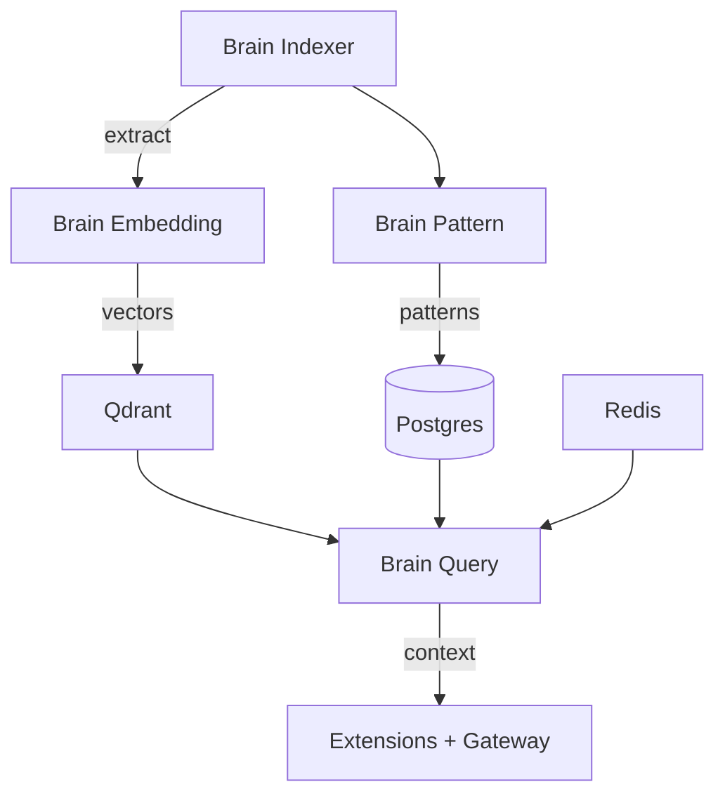

Brain is four services that index your repos and serve contextual code intelligence. This guide covers deploying the full stack.

---

## Architecture



---

## Services

### Brain Indexer

Clones repos, extracts function signatures, detects patterns, maps architectural boundaries. Indexing is triggered by webhook push events and runs incrementally — only changed files are re-processed.

| Port | Protocol | Purpose |
|------|----------|---------|
| `8060` | HTTP | Health checks, metrics |
| `50060` | gRPC | Internal RPC |

| Setting | Description | Default |
|---------|-------------|---------|
| `DATABASE_URL` | Brain database (Postgres) | Required |
| `EMBEDDING_SERVICE_URL` | Brain Embedding gRPC endpoint | Required |
| `server.httpPort` | HTTP port | `8060` |
| `server.grpcPort` | gRPC port | `50060` |
| `brain.maxConcurrentJobs` | Parallel indexing jobs | `10` |
| `brain.debounceMs` | Debounce webhook triggers | `500` |
| `brain.staleClaimTimeoutSecs` | Reclaim stale jobs after | `30` |

```yaml
# Helm values (brain-indexer)
replicaCount: 3
autoscaling:
  enabled: true
  minReplicas: 3
  maxReplicas: 20
  targetCPUUtilizationPercentage: 60
resources:
  requests:
    cpu: 250m
    memory: 512Mi
  limits:
    cpu: "1"
    memory: 1Gi
```

<Note>Indexer is CPU and memory-intensive during initial indexing. Scale up for large monorepos. The custom metric `brain_index_queue_depth` can drive HPA if enabled.</Note>

### Brain Embedding

Generates vector embeddings for semantic code search. Runs an ONNX model locally — no external AI API calls.

| Port | Protocol | Purpose |
|------|----------|---------|
| `8062` | HTTP | Health checks, metrics |
| `50062` | gRPC | Internal RPC |

| Setting | Description | Default |
|---------|-------------|---------|
| `DATABASE_URL` | Brain database (Postgres) | Required |
| `qdrant.url` | Qdrant HTTP endpoint | `http://qdrant:6333` |
| `qdrant.grpcPort` | Qdrant gRPC port | `6334` |
| `server.httpPort` | HTTP port | `8062` |
| `server.grpcPort` | gRPC port | `50062` |
| `embedding.pool` | Compute pool (`cpu` or `gpu`) | `cpu` |
| `embedding.modelPath` | ONNX model file path | `/models/cpu-v1.onnx` |
| `embedding.maxConcurrentJobs` | Parallel embedding jobs | `10` |
| `embedding.gpuTimeoutSecs` | GPU job timeout | `300` |

```yaml
# Helm values (brain-embedding)
replicaCount: 4
autoscaling:
  enabled: true
  minReplicas: 4
  maxReplicas: 12
  targetCPUUtilizationPercentage: 60
resources:
  requests:
    cpu: 500m
    memory: 512Mi
  limits:
    cpu: "2"
    memory: 1Gi
```

Embedding also has optional CronJobs for Qdrant maintenance:

| CronJob | Schedule | Purpose |
|---------|----------|---------|
| `qdrantOptimize` | `0 1 * * *` (1 AM daily) | Compact and optimize vectors |
| `qdrantBackup` | `0 2 * * *` (2 AM daily) | Snapshot to S3 |

Both are disabled by default. Enable in values.

### Brain Pattern

Analyzes repos for repeated coding patterns — error handling, auth, validation, data access. Runs as a **CronJob**, not a long-running service.

| Setting | Description | Default |
|---------|-------------|---------|
| `cronjob.schedule` | Cron expression | `0 * * * *` (hourly) |
| `cronjob.activeDeadlineSeconds` | Max run time | `3600` (1 hour) |
| `cronjob.concurrencyPolicy` | Allow overlapping runs | `Forbid` |
| `DATABASE_URL` | Brain database (Postgres) | Required |
| `REDIS_URL` | Redis for caching | Required |
| `derivation.concurrency` | Parallel analysis workers | `20` |
| `derivation.chunkSize` | Records per batch | `10000` |
| `derivation.retentionYears` | Pattern data retention | `2` |

```yaml
# Helm values (brain-pattern)
cronjob:
  schedule: "0 * * * *"
  concurrencyPolicy: Forbid
  activeDeadlineSeconds: 3600
resources:
  requests:
    cpu: 500m
    memory: 512Mi
  limits:
    cpu: "2"
    memory: 2Gi
```

<Note>Pattern is CPU-intensive during analysis but runs on a schedule — it does not consume resources between runs. No HTTP or gRPC ports.</Note>

### Brain Query

Serves contextual queries from extensions and gateways. Takes a file path and returns relevant functions, patterns, boundaries, and dependencies ranked by relevance score.

| Port | Protocol | Purpose |
|------|----------|---------|
| `8061` | HTTP | Health checks, metrics |
| `50061` | gRPC | Internal RPC |

| Setting | Description | Default |
|---------|-------------|---------|
| `qdrant.url` | Qdrant gRPC endpoint | `http://qdrant:6334` |
| `DATABASE_URL` | Brain database (Postgres) | Required |
| `REDIS_URL` | Redis for caching | Required |
| `server.httpPort` | HTTP port | `8061` |
| `server.grpcPort` | gRPC port | `50061` |
| `query.maxConcurrentPerOrg` | Max concurrent queries per org | `20` |
| `cache.hmacKeyKey` | HMAC key for cache integrity | Required |

```yaml
# Helm values (brain-query)
replicaCount: 4
autoscaling:
  enabled: true
  minReplicas: 4
  maxReplicas: 16
  targetCPUUtilizationPercentage: 70
resources:
  requests:
    cpu: 250m
    memory: 256Mi
  limits:
    cpu: 500m
    memory: 512Mi
```

---

## Dependencies

### Qdrant (vector database)

Embedding writes vectors; Query reads them. Both connect to Qdrant.

| Setting | Default |
|---------|---------|
| HTTP port | `6333` |
| gRPC port | `6334` |

Deploy Qdrant as a StatefulSet with persistent storage. The Embedding chart defaults to `http://qdrant:6333`, Query to `http://qdrant:6334`.

### Redis

Query and Pattern use Redis for caching.

| Consumer | Purpose |
|----------|---------|
| Brain Query | Cache query results, HMAC-signed cache keys |
| Brain Pattern | Pattern derivation cache |

### Postgres

All four services share a Brain database (separate from the Cloud database). Each service has its own connection pool and circuit breaker.

---

## Health checks

| Service | Endpoint | Port | Type |
|---------|----------|------|------|
| Brain Indexer | `/health` | `8060` | Deployment |
| Brain Embedding | `/health` | `8062` | Deployment |
| Brain Pattern | — | — | CronJob (no health endpoint) |
| Brain Query | `/health` | `8061` | Deployment |

---

## Circuit breakers

Every Brain service has circuit breakers on external dependencies. If a dependency fails repeatedly, the circuit opens and requests fail fast instead of cascading.

```yaml
# Example: brain-indexer circuit breakers
circuitBreaker:
  postgres:
    threshold: 3        # failures before open
    recoveryTimeout: 30 # seconds before half-open
    probeInterval: 10   # seconds between probes
  redis:
    threshold: 3
    recoveryTimeout: 30
    probeInterval: 15
  embedding:
    threshold: 5
    recoveryTimeout: 60
    probeInterval: 20
```

---

## Scaling notes

| Service | Strategy |
|---------|----------|
| **Indexer** | 3 replicas default. Scale with repo count — add replicas for 100+ repos. HPA on CPU or custom `brain_index_queue_depth` metric. |
| **Embedding** | 4 replicas default. Scale horizontally — each replica processes batches independently. CPU-bound with ONNX model. |
| **Pattern** | CronJob, single pod per run. Increase `derivation.concurrency` for faster analysis. |
| **Query** | 4 replicas default. Scale with request volume. Low latency — 4 replicas handle thousands of queries/min. |

---

<CardGroup cols={2}>
  <Card title="Brain Concept" icon="brain" href="/concepts/brain">
    How Brain intelligence works
  </Card>
  <Card title="Brain in Studio" icon="monitor" href="/studio/brain-context">
    Use Brain context from your editor
  </Card>
</CardGroup>
