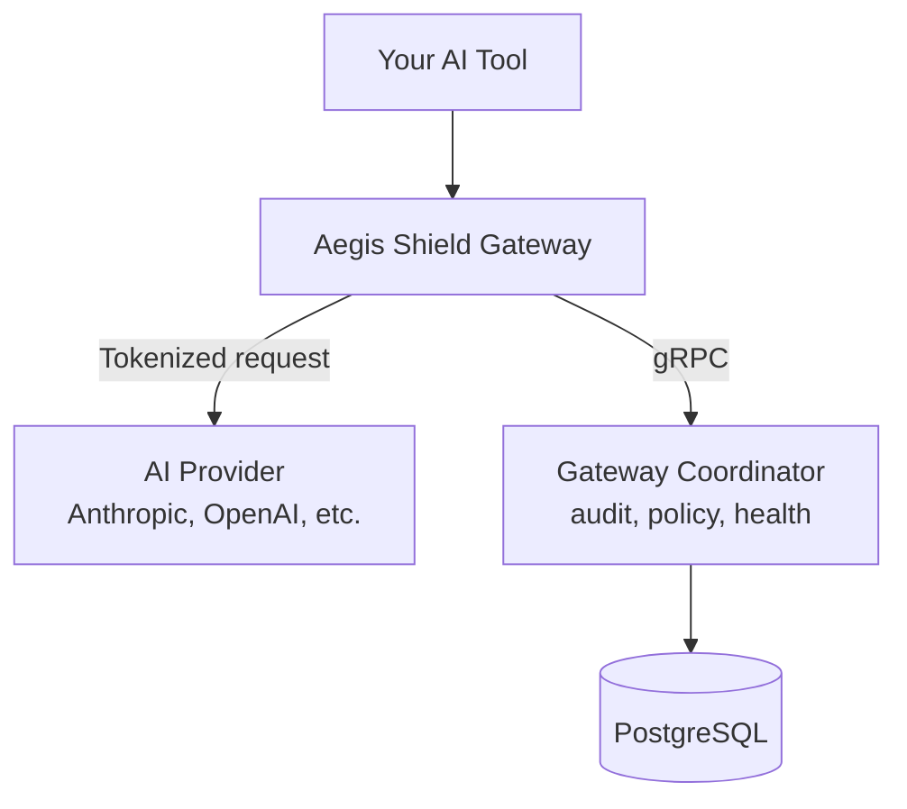

Takumo has three services. The gateway proxies AI requests. The coordinator connects gateways to the dashboard. The dashboard is where you manage everything.

## Services

### Aegis Shield Gateway (Rust)

Sits between your AI tool and the AI provider. Detects secrets in outbound requests, tokenizes them with deterministic reversible tokens, passes the sanitized request to the AI provider, and rehydrates tokens in the response before returning it to you.

Runs as a Kubernetes deployment or standalone binary. Stateless by default -- session vaults are held in memory per-request. Redis is used for distributed rate limiting and token revocation propagation across replicas.

### Gateway Coordinator (Rust)

gRPC server that manages gateway instances. Three responsibilities:

- **Audit shipping** -- Collects audit events from gateways and writes them to the dashboard database in batches (configurable via `telemetryBatchSize`, default 500 events per batch).
- **Policy sync** -- Streams policy updates from the dashboard to gateways in real-time. When you change a policy in the dashboard, the coordinator pushes the update within `policyDebouncMs` (default 500ms).
- **Health tracking** -- Receives health reports from gateways. Marks a gateway as stale after `healthStaleSecs` (default 120 seconds) without a report.

Exposes both HTTP (port 8080) and gRPC (port 9090).

### Dashboard (Next.js)

The management UI at cloud.takumo.io. Handles API keys, policies, team management, audit log, fleet monitoring, and billing.

### Supporting Infrastructure

| Service | Purpose |
|---------|---------|
| **PostgreSQL** | Shared database for all application state. Neon Postgres in SaaS, self-hosted for on-prem. |
| **Redis** | Distributed rate limiting, token revocation propagation, circuit breaker state sync across gateway replicas. |

## How requests flow

The gateway tokenizes secrets before forwarding to the AI provider, and ships audit events to the coordinator in the background.

1. Your AI tool sends a request to the gateway instead of directly to the AI provider.
2. The gateway scans the request for secrets. Found secrets are replaced with deterministic tokens.
3. The sanitized request is forwarded to the AI provider.
4. The AI provider responds. The gateway scans the response and rehydrates any tokens back to real values.
5. The restored response is returned to your tool.
6. In the background, the gateway ships an audit event to the coordinator, which writes it to the database.

## Deployment modes

<CardGroup cols={2}>
  <Card title="SaaS" icon="cloud" href="/deployment/saas">
    Takumo hosts everything. You configure your AI tool to use `gateway.takumo.io`. No infrastructure to manage.
  </Card>
  <Card title="On-Premises" icon="server" href="/deployment/onprem">
    You deploy the gateway and coordinator in your Kubernetes cluster. The dashboard can be SaaS or self-hosted. Full control over where data flows.
  </Card>
</CardGroup>

### When to use which

| | SaaS | On-Prem |
|--|------|---------|
| Setup time | Minutes | Hours |
| Infrastructure management | None | You manage K8s, Postgres, Redis |
| Data residency | Takumo-managed | Your infrastructure |
| Best for | Most teams | Strict compliance, air-gapped environments |
