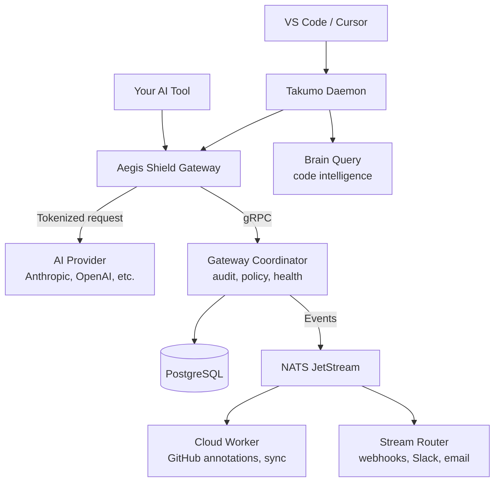

Takumo is a collection of services that work together. The gateway proxies AI requests. The coordinator manages fleet operations. The dashboard is where you manage everything. Brain provides code intelligence. Stream handles event routing.

## Services

### Aegis Shield Gateway (Rust)

Sits between your AI tool and the AI provider. Detects secrets in outbound requests, tokenizes them with deterministic reversible tokens, passes the sanitized request to the AI provider, and rehydrates tokens in the response before returning it to you.

Runs Sentinel inbound scanning on AI responses. Security vulnerabilities, license issues, and custom rule violations are flagged or blocked depending on policy.

Runs as a Kubernetes deployment or standalone binary. Stateless by default — session vaults are held in memory per-request. Redis is used for distributed rate limiting and token revocation propagation across replicas.

### Gateway Coordinator (Rust)

gRPC server that manages gateway instances. Four responsibilities:

- **Audit shipping** — Collects audit events from gateways and writes them to the dashboard database in batches (configurable via `telemetryBatchSize`, default 500 events per batch).
- **Policy sync** — Streams policy updates from the dashboard to gateways in real-time. When you change a policy in the dashboard, the coordinator pushes the update within `policyDebounceMs` (default 500ms).
- **Health tracking** — Receives health reports from gateways. Marks a gateway as stale after `healthStaleSecs` (default 120 seconds) without a report.
- **NATS publishing** — Publishes detection events to NATS JetStream for downstream processing by the Cloud Worker and Stream pipeline.

Exposes both HTTP (port 8080) and gRPC (port 9090).

### Dashboard (Next.js)

The management UI at cloud.takumo.io. Handles API keys, policies, team management, audit log, fleet monitoring, Sentinel detections, notifications, streaming management, and billing.

### Cloud Worker

Standalone process running alongside the dashboard. Consumes NATS detection events for durable processing. Runs catch-up cron jobs for missed events. Handles Bitbucket webhook sync. Bridges GitHub check run annotations from Sentinel detections.

### Takumo Daemon (Rust)

Local HTTP server that runs on developer machines. Bridge between the editor extension and Takumo's cloud services. Handles scanning, secret detection, AI transforms, Brain queries, auth, policy enforcement, and incident notifications. Communicates with the extension via HTTP + WebSocket.

### Brain Intelligence (4 services)

| Service | Purpose |
|---------|---------|
| **Brain Indexer** | Scans connected repos, extracts functions, patterns, and boundaries |
| **Brain Embedding** | Generates vector embeddings for semantic code search |
| **Brain Pattern** | Detects repeated coding patterns across your codebase |
| **Brain Query** | Serves contextual queries from extensions and the gateway |

### Takumo Stream (3 services)

| Service | Purpose |
|---------|---------|
| **Stream Ingest** | Receives events via HTTP/gRPC, writes to NATS JetStream |
| **Stream Router** | Routes events to destinations based on subscription filters |
| **NATS** | JetStream message broker for durable event delivery |

### Vault Service (Rust)

Cryptographic fingerprinting and salt management. Provides deterministic tokenization with salt rotation for forward secrecy. gRPC + HTTP API with 9 RPCs.

### Supporting Infrastructure

| Service | Purpose |
|---------|---------|
| **PostgreSQL** | Shared database for all application state. Neon Postgres in SaaS, self-hosted for on-prem. |
| **Redis** | Distributed rate limiting, token revocation propagation, circuit breaker state sync across gateway replicas. |
| **NATS** | JetStream message broker for event distribution between services. |

## How requests flow

## Full service inventory

| Service | Language | Helm Chart | Ports |
|---------|----------|------------|-------|
| Aegis Shield Gateway | Rust | `aegis-shield` | 8080 (HTTP) |
| Gateway Coordinator | Rust | `gateway-coordinator` | 8080 (HTTP), 9090 (gRPC) |
| Dashboard | Next.js | `cloud` | 3000 |
| Cloud Worker | Next.js | `cloud` (sidecar) | — |
| Takumo Daemon | Rust | — (local binary) | 19532 |
| Brain Indexer | Rust | `brain-indexer` | 8060 (HTTP), 50060 (gRPC) |
| Brain Embedding | Rust | `brain-embedding` | 8062 (HTTP), 50062 (gRPC) |
| Brain Pattern | Rust | `brain-pattern` | — (CronJob) |
| Brain Query | Rust | `brain-query` | 8061 (HTTP), 50061 (gRPC) |
| Stream Ingest | Rust | `takumo-stream-ingest` | 8080 (HTTP), 50051 (gRPC) |
| Stream Router | Rust | `takumo-stream-router` | 9090 (HTTP), 9091 (gRPC admin) |
| Vault Service | Rust | `vault-service` | 8080 (HTTP), 50053 (gRPC) |
| Sentinel Service | Rust | `sentinel-service` | 50051 (gRPC) |
| NATS | Go | `takumo-stream-nats` | 4222 |

## Deployment modes

<CardGroup cols={2}>
  <Card title="SaaS" icon="cloud" href="/deployment/saas">
    Takumo hosts everything. You configure your AI tool to use `gateway.takumo.io`. No infrastructure to manage.
  </Card>
  <Card title="On-Premises" icon="server" href="/deployment/onprem">
    You deploy the gateway and coordinator in your Kubernetes cluster. The dashboard can be SaaS or self-hosted. Full control over where data flows.
  </Card>
</CardGroup>

### When to use which

| | SaaS | On-Prem |
|--|------|---------|
| Setup time | Minutes | Hours |
| Infrastructure management | None | You manage K8s, Postgres, Redis, NATS |
| Data residency | Takumo-managed | Your infrastructure |
| Brain intelligence | Included | Deploy 4 Brain services |
| Streaming | Included | Deploy Stream Ingest, Router, NATS |
| Best for | Most teams | Strict compliance, air-gapped environments |

---

<CardGroup cols={2}>
  <Card title="SaaS Setup" icon="cloud" href="/deployment/saas">
    Get running in minutes
  </Card>
  <Card title="On-Prem Guide" icon="server" href="/deployment/onprem">
    Full Kubernetes deployment
  </Card>
  <Card title="Configuration" icon="wrench" href="/deployment/configuration">
    Environment variables and Helm values
  </Card>
  <Card title="Monitoring" icon="activity" href="/deployment/monitoring">
    Prometheus, Grafana, and alerting
  </Card>
</CardGroup>
