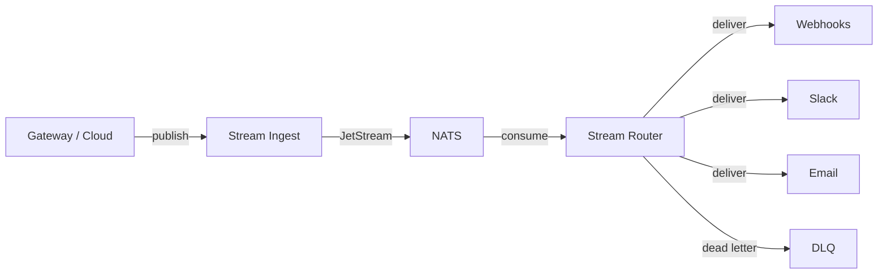

The Stream pipeline has three components: Ingest, Router, and NATS. This guide covers deploying the full stack.

---

## Architecture



---

## Components

### Stream Ingest

Accepts events over HTTP/gRPC and publishes to NATS JetStream.

| Setting | Description | Default |
|---------|-------------|---------|
| `NATS_URL` | NATS server URL | Required |
| `NATS_NKEY_SEED` | NKey seed for authentication | Required |
| `DATABASE_URL` | Stream database (Postgres) | Required |
| `HTTP_BIND` | Ingest HTTP bind address | `0.0.0.0:8080` |
| `GRPC_BIND` | Ingest gRPC bind address | `0.0.0.0:50051` |
| `NATS_PUBLISH_TIMEOUT_MS` | NATS publish timeout | `2000` |
| `MAX_BATCH_SIZE` | Maximum events per batch | `1000` |
| `DB_MAX_CONNECTIONS` | Database connection pool size | `20` |
| `JWT_ISSUER` | Expected JWT issuer | `https://takumo.io` |
| `JWT_AUDIENCE` | Expected JWT audience | `stream` |

Helm values (`takumo-stream-ingest`):

```yaml
replicaCount: 2
resources:
  requests:
    cpu: 500m
    memory: 512Mi
  limits:
    cpu: 2000m
    memory: 1Gi
nats:
  url: "nats://takumo-stream-nats:4222"
```

### Stream Router

Consumes events from NATS and delivers to configured destinations. Runs 7 admin RPCs for managing destinations, subscriptions, and the DLQ.

| Setting | Description | Default |
|---------|-------------|---------|
| `NATS_URL` | NATS server URL | Required |
| `NATS_NKEY_SEED` | NKey seed for authentication | Required |
| `ROUTER_HTTP_ADDR` | HTTP bind address (health, metrics, admin) | `0.0.0.0:9090` |
| `ROUTER_ADMIN_GRPC_ADDR` | Admin gRPC bind address | `0.0.0.0:9091` |
| `DATABASE_URL` | Stream database (Postgres) | Required |
| `ROUTER_KMS_KEY_B64` | AES-256-GCM key (base64) for credential encryption | Required |
| `RETRY_MAX_ATTEMPTS` | Delivery retry count | `5` |
| `RETRY_BASE_DELAY_MS` | Base backoff between retries | `1000` |
| `RETRY_MAX_DELAY_MS` | Maximum backoff between retries | `60000` |
| `NATS_ACK_WAIT_SECS` | NATS ack wait before redelivery | `30` |
| `MAX_INFLIGHT` | Maximum in-flight deliveries | `256` |

Helm values (`takumo-stream-router`):

```yaml
replicaCount: 2
resources:
  requests:
    cpu: 1000m
    memory: 1Gi
  limits:
    cpu: 4000m
    memory: 4Gi
nats:
  url: "nats://takumo-stream-nats:4222"
server:
  httpPort: 9090
  adminGrpcPort: 9091
```

<Warning>The `ROUTER_KMS_KEY_B64` encrypts destination credentials at rest. Losing this key means you cannot decrypt existing credentials — you'll need to re-enter them.</Warning>

### NATS

JetStream-enabled NATS server for event transport.

| Setting | Description | Default |
|---------|-------------|---------|
| `jetstream.enabled` | Enable JetStream | `true` |
| `jetstream.maxMemory` | In-memory store limit | `1Gi` |
| `jetstream.maxFile` | File store limit | `45Gi` |

Helm values (`takumo-stream-nats`):

```yaml
jetstream:
  enabled: true
  maxMemory: 1Gi
  maxFile: 45Gi
persistence:
  enabled: true
  size: 50Gi
```

<Note>If running behind Linkerd, add `config.linkerd.io/opaque-ports: "4222"` to the NATS service. NATS uses raw TCP, not HTTP — Linkerd's protocol detection will break the connection without this annotation.</Note>

---

## NATS authentication

Each service authenticates to NATS with an NKey (Ed25519 keypair). Four NKeys per cluster:

| NKey | Service |
|------|---------|
| `stream-ingest` | Stream Ingest |
| `stream-router` | Stream Router |
| `coordinator` | Gateway Coordinator |
| `worker` | Cloud Worker |

Generate NKeys:

```bash
nk -gen user -pubout
```

Configure NATS authorization in `nats.conf`:

```
authorization {
  users = [
    { nkey: "UABC..." , permissions: { publish: "takumo.>" , subscribe: "takumo.>" } }
  ]
}
```

Store seeds as Kubernetes secrets. Use SealedSecrets or an external secrets operator for production environments.

---

## Database migrations

Stream Postgres migrations live in `crates/takumo-stream-ingest/sql/V*.sql`. They run on Ingest startup.

<Warning>Never run `prisma migrate` or `prisma db push` against the Stream database. The Cloud Prisma client is a read-only consumer — migrations are owned by the Rust services.</Warning>

---

## Health checks

| Service | Liveness | Readiness | Port |
|---------|----------|-----------|------|
| Stream Ingest | `/healthz` | `/readyz` | `8080` |
| Stream Router | `/healthz` | `/readyz` | `9090` |
| NATS | Monitoring port | — | `8222` |

---

<CardGroup cols={2}>
  <Card title="Streaming Concept" icon="radio" href="/concepts/streaming">
    How the event pipeline works
  </Card>
  <Card title="Streaming Dashboard" icon="layout-dashboard" href="/dashboard/streaming">
    Manage destinations and subscriptions
  </Card>
</CardGroup>
