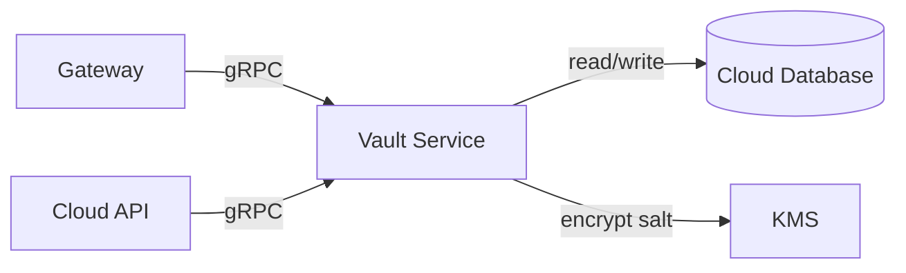

The Vault Service handles secret fingerprinting — storing split-salt hashes of detected secrets so Takumo can track recurrence across scans without ever storing the secret itself.

---

## Architecture



The Vault Service is a standalone Rust binary that exposes both HTTP and gRPC interfaces. It shares the Cloud database (same Postgres instance) but runs as a separate deployment.

---

## Ports

| Port | Protocol | Purpose |
|------|----------|---------|
| `8080` | HTTP | Health checks (`/healthz`, `/readyz`), metrics |
| `50053` | gRPC | RPC interface for fingerprint operations |

---

## Configuration

| Setting | Description | Default |
|---------|-------------|---------|
| `server.httpPort` | HTTP port | `8080` |
| `server.grpcPort` | gRPC port | `50053` |
| `server.shutdownTimeout` | Graceful shutdown seconds | `30` |
| `vault.dbMaxConnections` | Database connection pool max | `20` |
| `vault.dbAcquireTimeoutSecs` | Connection acquire timeout | `5` |
| `vault.janitorIntervalSecs` | Stale fingerprint cleanup interval | `300` |
| `vault.staleFingerprintDays` | Days before a fingerprint is considered stale | `90` |
| `vault.rateLimitLookupPerSec` | Lookup rate limit | `1000` |
| `vault.rateLimitStorePerSec` | Store rate limit | `100` |
| `vault.rateLimitDeletePerMin` | Delete rate limit | `10` |
| `vault.maxConcurrentRpcs` | Max concurrent gRPC requests | `500` |

---

## Helm values

```yaml
# vault-service/values.yaml
replicaCount: 2
autoscaling:
  enabled: true
  minReplicas: 2
  maxReplicas: 10
  targetCPUUtilizationPercentage: 70
  targetMemoryUtilizationPercentage: 80
resources:
  requests:
    cpu: 100m
    memory: 256Mi
  limits:
    cpu: 500m
    memory: 512Mi
```

---

## Secrets

| Secret | Key | Description |
|--------|-----|-------------|
| `cloud-database` | `database-url` | Postgres connection string (shared with Cloud API) |
| `cloud-database` | `database-url-direct` | Direct Postgres connection (bypasses pooler) |
| `vault-salt-kms` | `salt-kms` | KMS key for encrypting salt values |

The Vault Service uses the Cloud database. It reads/writes `VaultFingerprint`, `VaultSalt`, and `VaultSaltRotation` tables.

<Warning>The Vault Service shares the Cloud database. Do not deploy it against a separate database — the fingerprints must be accessible to the Cloud API for issue correlation.</Warning>

---

## RPCs

The Vault Service exposes 9 gRPC RPCs:

| RPC | Description |
|-----|-------------|
| `StoreFingerprint` | Store a split-salt fingerprint for a detected secret |
| `LookupFingerprint` | Check if a secret has been seen before |
| `DeleteFingerprint` | Remove a fingerprint |
| `RotateSalt` | Rotate the organization's salt key |
| `GetSaltStatus` | Check salt rotation status |
| `ListFingerprints` | List fingerprints for an organization |
| `BatchStore` | Store multiple fingerprints in one call |
| `BatchLookup` | Look up multiple fingerprints in one call |
| `HealthCheck` | gRPC health check |

---

## Health checks

| Endpoint | Port | Method |
|----------|------|--------|
| `/healthz` | `8080` | Liveness — is the process alive? |
| `/readyz` | `8080` | Readiness — are database and KMS connections healthy? |

---

## Scaling

The Vault Service is lightweight. 2 replicas handle most workloads. Scale based on:

- **CPU** — Fingerprint hashing is CPU-bound but fast
- **Memory** — Mostly connection pool overhead
- **gRPC concurrency** — `maxConcurrentRpcs` limits in-flight requests (default 500)

The janitor runs every 5 minutes to clean up fingerprints older than `staleFingerprintDays`.

---

<CardGroup cols={2}>
  <Card title="Vault Concept" icon="lock" href="/concepts/vault">
    How secret fingerprinting works
  </Card>
  <Card title="Security" icon="shield" href="/concepts/security">
    Security architecture
  </Card>
</CardGroup>
