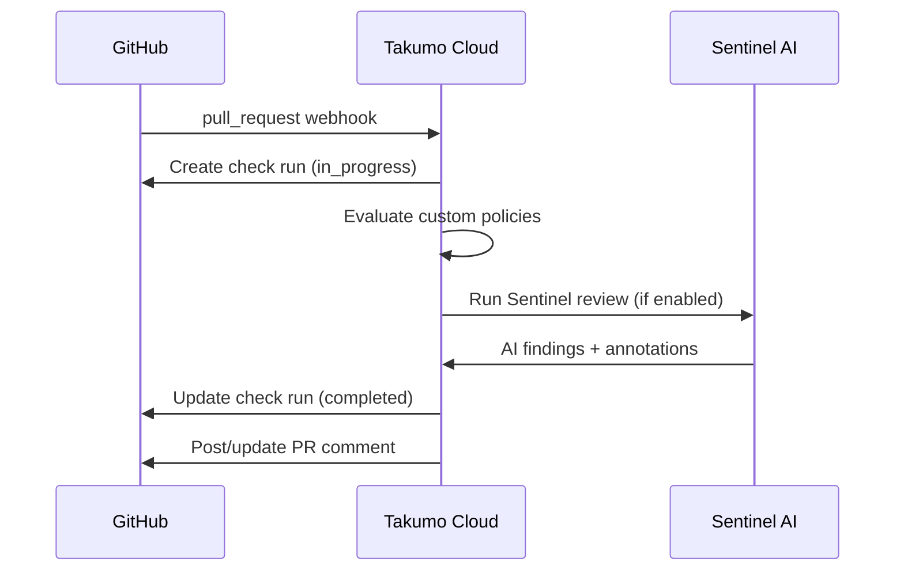

The Takumo GitHub App runs Sentinel on every pull request, enforces custom policies, ingests security alerts, and triggers Brain indexing on push.

---

## Setup

<Steps>
  <Step title="Install the GitHub App">
    Go to **Dashboard → Settings → Integrations → GitHub** and click **Install**. You'll be redirected to GitHub to authorize the app.
  </Step>
  <Step title="Select repositories">
    Choose **All repositories** or select specific ones. Takumo needs read access to code and pull requests, and write access to checks and issues.
  </Step>
  <Step title="Confirm in dashboard">
    After authorization, you'll see your connected repos in **Dashboard → Settings → Integrations**. Takumo begins syncing branch protection, CODEOWNERS, and security features immediately.
  </Step>
</Steps>

---

## What happens on a pull request

When a PR is opened or updated:

### Policy check

Takumo evaluates your published custom rules against the PR's changed files. Each violation is reported as an inline annotation on the check run.

Enforcement modes:
- **Block** — Check run concludes as `failure`. PR cannot merge (if branch protection requires the check).
- **Warn** — Check run concludes as `success` with annotations. Violations are logged but don't block.
- **Monitor** — Violations are logged silently. No annotations.

### Sentinel AI review

If enabled, Sentinel runs an AI-powered security review on the PR diff. It looks for:
- Security vulnerabilities (injection, XSS, SSRF, etc.)
- Secret exposure
- Authentication/authorization issues
- Unsafe dependency usage

Sentinel AI is rate-limited per org: 5 reviews per 60 seconds, with a daily cap based on your plan. Draft PRs and bot PRs (Dependabot, Renovate) are skipped.

The AI conclusion is merged with the policy check. AI can escalate severity (e.g., policy says `success` but AI found a critical issue → `failure`), but never downgrade.

### PR comment

Takumo posts a summary comment on the PR (or updates the existing one). The comment includes:
- Policy violations with severity and rule name
- Sentinel AI findings with suggested fixes
- Overall status

The comment is identified by `<!-- takumo-check -->` — Takumo updates the same comment on subsequent pushes rather than creating new ones.

---

## Security alert ingestion

Takumo consumes GitHub security alerts and converts them to Issues:

| Alert type | What Takumo does |
|-----------|-----------------|
| `secret_scanning_alert` | Creates a secret exposure Issue |
| `code_scanning_alert` | Creates a vulnerability Issue |
| `dependabot_alert` | Creates a dependency Issue |

These appear in **Dashboard → Sentinel Detections** alongside Takumo's own findings.

---

## CI/CD pipeline analysis

Takumo syncs your GitHub Actions workflows and analyzes them for security issues:

- `pull_request_target` triggers (dangerous — can expose secrets to forks)
- `workflow_dispatch` without input validation
- Third-party actions without SHA pinning
- `permissions: write-all` (overly broad)
- Secrets used directly in `run` steps

Findings appear in the CI/CD section of each repository's detail page.

### Auto-remediation

When Takumo identifies a fixable workflow issue, it can create a PR with the fix. Templates cover common patterns like pinning action versions and restricting permissions.

---

## Brain indexing

Push events trigger incremental re-indexing. When you push to a connected repo, Brain Indexer processes only the changed files — updating function signatures, patterns, and boundaries.

---

## Webhook events

The GitHub App handles these webhook events:

| Event | Action |
|-------|--------|
| `pull_request` (opened, synchronize) | Run policy check + Sentinel review |
| `pull_request` (closed) | Sync remediation PR status |
| `check_suite` (requested) | Run policy check |
| `push` | Trigger Brain re-indexing + compliance sync |
| `secret_scanning_alert` | Create Issue |
| `code_scanning_alert` | Create Issue |
| `dependabot_alert` | Create Issue |
| `branch_protection_rule` | Re-sync compliance data |
| `workflow_run` (completed) | Update pipeline metrics |
| `installation` / `installation_repositories` | Manage integration status |

---

## Permissions required

| Permission | Access | Why |
|-----------|--------|-----|
| Contents | Read | Analyze code, read workflows |
| Pull requests | Read + Write | Post comments |
| Checks | Read + Write | Create check runs |
| Issues | Read + Write | Auto-remediation PRs |
| Metadata | Read | Repository info |
| Security events | Read | Secret/code scanning alerts |

---

<CardGroup cols={2}>
  <Card title="Sentinel Concept" icon="eye" href="/concepts/sentinel">
    How Sentinel scanning works
  </Card>
  <Card title="Sentinel Dashboard" icon="layout-dashboard" href="/dashboard/sentinel">
    View detections in the dashboard
  </Card>
</CardGroup>
