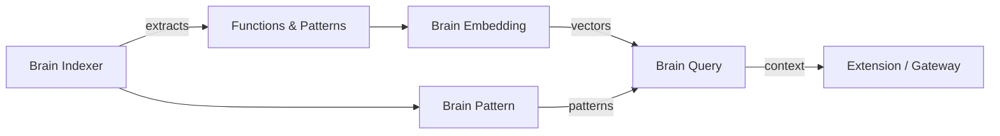

# Brain Context

Brain gives you contextual intelligence about your codebase — relevant functions, established patterns, architecture boundaries, and dependency info — all from inside your editor.

<Note>Brain requires authentication. Not available in demo mode.</Note>

---

## Using it

`Cmd+Shift+P` → **Takumo: Show Brain Context**

The extension sends your current file's path, language, and repo ID to the daemon, which queries Brain Query. Results appear in the side panel.

---

## What it returns

### Relevant functions

Functions in your codebase related to the current file:

| Field | Description |
|-------|-------------|
| `name` | Function name |
| `filePath` | Where it lives |
| `signature` | Full function signature |
| `description` | What it does |
| `relevanceScore` | 0-1 relevance to current file |

### Established patterns

Recurring patterns across your codebase:

| Field | Description |
|-------|-------------|
| `patternName` | Pattern identifier |
| `description` | What the pattern does |
| `category` | Classification (e.g., error-handling, auth, validation) |
| `usageCount` | How many times it appears |

### Architecture boundaries

Security and structural boundaries:

| Field | Description |
|-------|-------------|
| `boundaryType` | Type of boundary (e.g., auth-boundary, api-layer) |
| `filePath` | Where the boundary is defined |
| `description` | What the boundary enforces |

### Dependency context

Dependencies relevant to the current file:

| Field | Description |
|-------|-------------|
| `packageName` | Package name |
| `version` | Installed version |
| `usageContext` | How it's used in this context |

---

## How Brain indexes

After you connect a repo via GitHub, GitLab, or Bitbucket integration, Brain Indexer scans the repository automatically. Indexing is incremental — only changed files are re-processed.

---

<CardGroup cols={2}>
  <Card title="Brain Concept" icon="brain" href="/concepts/brain">
    How the Brain stack works
  </Card>
  <Card title="Integrations" icon="plug" href="/integrations/overview">
    Connect your repos for indexing
  </Card>
</CardGroup>
