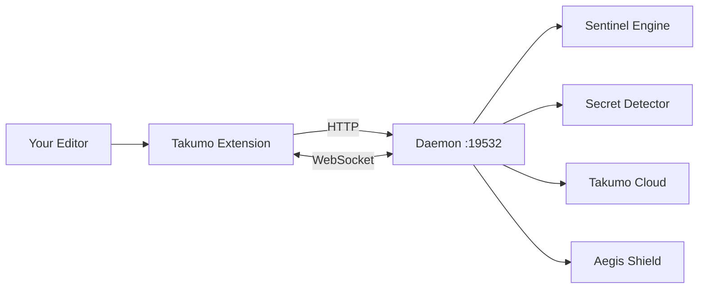

# Takumo Studio

Real-time code scanning, secret detection, AI transforms, and Brain intelligence — inside your editor.

Takumo Studio is a VS Code extension that connects to a local daemon process. Everything runs on your machine. Your code never leaves unless you explicitly send it to an AI.

---

## What it does

| Feature | What happens |
|---------|-------------|
| **Scanning** | Sentinel rules run on every save. Issues show as inline diagnostics. |
| **Secret detection** | 30+ patterns caught in real time. Quick-fix replaces with env vars. |
| **AI transforms** | Select code with issues → AI rewrites it → preview diff → apply or dismiss. |
| **Brain context** | Workspace-aware intelligence: relevant functions, patterns, boundaries. |
| **Paste interception** | AI-generated pastes are auto-scanned for secrets and vulnerabilities. |
| **Incidents** | Real-time notifications when your org has security violations. |
| **Custom rules** | Create Sentinel rules from selected code. Syncs to your team. |
| **Policies** | Org-managed settings pushed to all members. Lock indicators on forced settings. |

---

## Supported editors

| Editor | Installation |
|--------|-------------|
| **VS Code** | Marketplace (platform-specific VSIX with bundled daemon) |
| **Cursor** | Marketplace or universal VSIX with auto-download |
| **Windsurf** | Universal VSIX with auto-download |
| **VS Code-compatible** | Universal VSIX sideload |

---

## Architecture

The extension is the UI layer. The daemon does the work. All communication is local HTTP and WebSocket on `127.0.0.1:19532`.

---

## Quick links

<CardGroup cols={2}>
  <Card title="Installation" icon="download" href="/studio/installation">
    Install for VS Code, Cursor, or Windsurf
  </Card>
  <Card title="Getting Started" icon="rocket" href="/studio/getting-started">
    First 5 minutes after install
  </Card>
  <Card title="Scanning" icon="scan" href="/studio/scanning">
    How real-time scanning works
  </Card>
  <Card title="Secret Detection" icon="key" href="/studio/secrets">
    30+ secret patterns with language-aware quick fixes
  </Card>
  <Card title="AI Transforms" icon="wand" href="/studio/transforms">
    AI-powered code rewriting with diff preview
  </Card>
  <Card title="Brain Context" icon="brain" href="/studio/brain-context">
    Workspace-aware code intelligence
  </Card>
  <Card title="Commands" icon="terminal" href="/studio/commands">
    All 21 commands reference
  </Card>
  <Card title="Settings" icon="sliders" href="/studio/settings">
    All configurable settings
  </Card>
</CardGroup>
