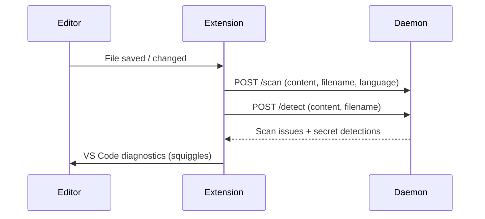

# Scanning

Every file you touch gets scanned. Results show up as native VS Code diagnostics — the same squiggles and Problems panel you already know.

---

## Scan triggers

| Trigger | Setting | Default | Behavior |
|---------|---------|---------|----------|
| On save | `takumo.scan.onSave` | `true` | Scans the full file when you save |
| On type | `takumo.scan.onType` | `true` | Scans as you type, debounced |
| Manual | Command palette | — | `Takumo: Scan Current File` or `Takumo: Scan Workspace` |

---

## How it works



The extension sends your file content to the local daemon over HTTP on `127.0.0.1:19532`. The daemon runs Sentinel rules and the secret detector in parallel, then returns results. Your code never leaves your machine.

---

## Scan results

Results appear in three places:

1. **Inline squiggles** — Underlines on affected lines, colored by severity
2. **Problems panel** — `Cmd+Shift+M` to see all diagnostics across files
3. **Side panel** — Takumo sidebar shows results with severity and line numbers

### Severity levels

| Severity | Color | Examples |
|----------|-------|----------|
| Critical | Red | Hardcoded secrets, SQL injection, exposed credentials |
| Warning | Yellow | Weak patterns, missing validation, insecure defaults |
| Info | Blue | Style improvements, best practice suggestions |

---

## Debounce

On-type scanning is debounced to avoid hammering the daemon. Default: 500ms.

```json
{
  "takumo.scan.debounceMs": 500
}
```

Lower values = faster feedback, more CPU. Higher values = calmer. 500ms is a good default.

<Note>When you save, any pending on-type scan is cancelled. The on-save scan takes priority so you don't get duplicates.</Note>

---

## Workspace scanning

Scan every file at once:

```
Takumo: Scan Workspace
```

Results accumulate in the Problems panel. Useful before a commit or PR.

## Selection scanning

Select code, then:
- **Command palette:** `Takumo: Scan Selection`
- **Right-click:** "Scan Selection" in the context menu

Only the selected code is scanned. Diagnostics map to correct positions in the file.

---

## Quick fixes

Hover over a diagnostic and click the lightbulb (`Cmd+.`):

- **Replace with environment variable** — Language-aware replacement for secrets
- **Suppress for this line** — Adds `// takumo-ignore RULE-ID` comment
- **Fix all N secrets in file** — Batch replacement

---

## Configuration

| Setting | Type | Default | Description |
|---------|------|---------|-------------|
| `takumo.enabled` | boolean | `true` | Master switch |
| `takumo.scan.onSave` | boolean | `true` | Scan on save |
| `takumo.scan.onType` | boolean | `true` | Scan while typing |
| `takumo.scan.debounceMs` | number | `500` | Debounce delay (ms) |
| `takumo.secrets.enabled` | boolean | `true` | Enable secret detection |
| `takumo.notifications.showScanResults` | boolean | `true` | Show notifications |

---

<CardGroup cols={2}>
  <Card title="Secret Detection" icon="key" href="/studio/secrets">
    Deep dive into secret patterns and quick fixes
  </Card>
  <Card title="The Daemon" icon="cpu" href="/studio/daemon">
    How the scanning engine runs locally
  </Card>
</CardGroup>
