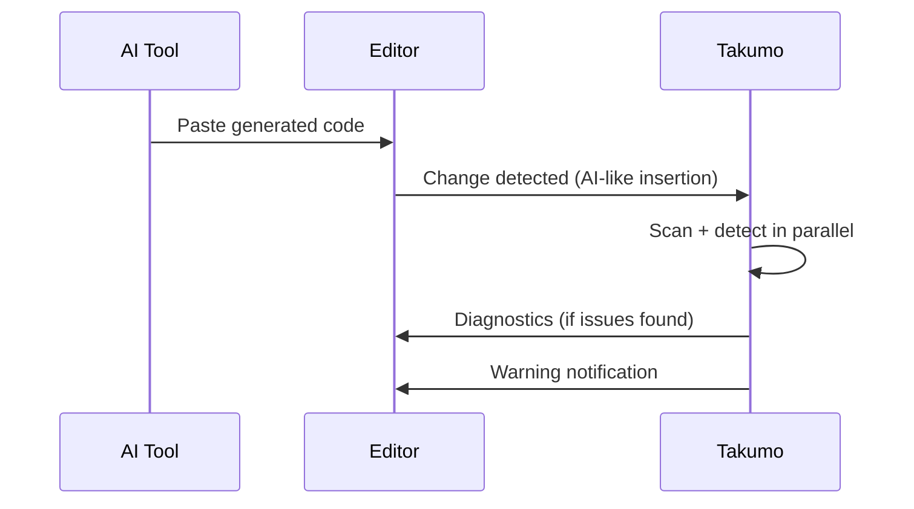

# Secret Detection

You hardcode a database URL. You paste an API key from Slack. You commit a `.env` value into a config file. Takumo catches all of it — inline, in real time, before anything leaves your machine.

---

## What it detects

30+ secret patterns:

| Category | Examples |
|----------|----------|
| AWS | Access keys (`AKIA...`), secret keys, session tokens |
| Stripe | Secret keys (`sk_live_...`), publishable keys, webhook secrets |
| Database | PostgreSQL, MySQL, MongoDB, Redis connection URIs with credentials |
| Auth | JWTs (`eyJ...`), bearer tokens, OAuth tokens, session secrets |
| GitHub | Personal access tokens (`ghp_...`, `github_pat_...`) |
| GitLab | Personal/project tokens (`glpat-...`) |
| Google Cloud | Service account keys, API keys |
| Azure | Connection strings, SAS tokens |
| Private keys | RSA, EC, OpenSSH, PGP key blocks |
| npm/Slack | Auth tokens, webhook URLs |
| Generic | Values assigned to `password`, `secret`, `api_key`, `token` |

---

## Quick fixes

Hover over a detected secret and press `Cmd+.`. Takumo suggests **Replace with environment variable** — and the replacement is language-aware:

<CodeGroup>
```typescript TypeScript / JavaScript
// Before
const stripeKey = "sk_test_abc123EXAMPLE";
// After
const stripeKey = process.env.STRIPE_KEY;
```

```python Python
# Before
stripe_key = "sk_test_abc123EXAMPLE"
# After
stripe_key = os.environ['STRIPE_KEY']
```

```go Go
// Before
stripeKey := "sk_test_abc123EXAMPLE"
// After
stripeKey := os.Getenv("STRIPE_KEY")
```

```rust Rust
// Before
let stripe_key = "sk_test_abc123EXAMPLE";
// After
let stripe_key = std::env::var("STRIPE_KEY");
```

```ruby Ruby
# Before
stripe_key = "sk_test_abc123EXAMPLE"
# After
stripe_key = ENV['STRIPE_KEY']
```
</CodeGroup>

The env var name is inferred from the variable name or detection category.

### Batch fix

When a file has multiple secrets: **Fix all N secrets in file** — one click replaces them all.

---

## Clipboard monitoring

Takumo watches your clipboard for secrets. Copy code with an API key and you'll get a notification before you paste it somewhere unsafe.

| Setting | Default |
|---------|---------|
| `takumo.secrets.clipboardMonitoring` | `true` |

---

## Paste interception

You paste code from ChatGPT or Copilot. If it's large enough (3+ lines, 50+ characters), Takumo intercepts automatically.



If `transformMode` is set to `auto`, the transform engine queues a rewrite automatically.

| Setting | Type | Default | Description |
|---------|------|---------|-------------|
| `takumo.interception.enabled` | boolean | `true` | Enable paste interception |
| `takumo.interception.minLines` | number | `3` | Minimum lines to trigger |
| `takumo.interception.minChars` | number | `50` | Minimum characters to trigger |

---

## Privacy

Secret detection runs entirely on your local daemon. No code is sent to any external service during detection.

<Warning>Even with `sendCodeSnippets` enabled, Takumo Cloud never stores raw secret values. Detection metadata is stored; the secret content itself is always redacted server-side.</Warning>

---

<CardGroup cols={2}>
  <Card title="Scanning" icon="scan" href="/studio/scanning">
    Full scanning configuration
  </Card>
  <Card title="Supported Patterns" icon="list" href="/patterns/supported">
    Complete detection pattern list
  </Card>
</CardGroup>
